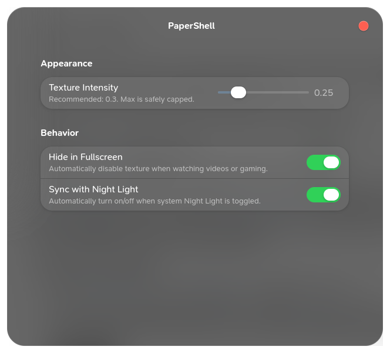

# PaperShell 📜

A GNOME 49 Shell Extension designed to enhance screen readability and reduce eye strain by adding a subtle, customizable texture overlay to your entire desktop.

Inspired by research on visual ergonomics, this extension applies a noise texture (grain effect) over your screen. By mimicking the natural texture of paper, it softens the harshness of flat, bright digital displays, making long reading or coding sessions significantly more comfortable for your eyes.

### ✨ New in v1.0.0

- **Quick Settings Integration:** Toggle PaperShell directly from the main GNOME system menu.
- **Persistent Settings:** Your opacity and toggle states are now saved across reboots.
- **Fullscreen Hiding:** Toggle to automatically disable the texture when you're gaming or watching videos.
- **Night Light Sync:** Optional mode to automatically activate the texture only when system Night Light is active.

---

### 🚀 Features

- **Global Overlay:** Seamless, semi-transparent texture across all monitors and displays.
- **Zero Interference:** Completely click-through; never interferes with your workflow or input.
- **Advanced Preferences:** Fine-tune texture intensity using the Extension Settings.
- **High-Performance Rendering:** Uses native Clutter constraints for zero-lag performance on HiDPI and 4K displays.

#### Filter Off


#### Filter On


---

### 📥 Installation

Because this version uses **GSettings**, you must compile the schemas for the extension to function.

1.  **Download/Clone** the repository into your extensions folder:

    ```bash
    git clone https://github.com/LaloVene/PaperShell.git ~/.local/share/gnome-shell/extensions/papershell@lalovene.github.com
    ```

2.  **Compile the Schemas** (Required for settings to work):

    ```bash
    cd ~/.local/share/gnome-shell/extensions/papershell@lalovene.github.com
    glib-compile-schemas schemas/
    ```

3.  **Restart GNOME Shell:**
    Log out and log back in.

4.  **Enable:**
    Use the **Extensions** app or run:

    ```bash
    gnome-extensions enable papershell@lalovene.github.com
    ```

---

### ⚙️ Configuration

Access the settings by clicking the **Gear Icon** next to PaperShell in the GNOME Extensions app.

- **Texture Intensity:** Adjust the slider to find your perfect balance.
- **Behavior:** Toggle "Hide in Fullscreen" or "Sync with Night Light" to automate your environment.
- **Custom Textures:** You can still replace the `noise.png` inside the extension folder with any image of your choice for a personalized feel.



---

### 🙏 Credits & Acknowledgements

This extension is a Linux/GNOME port inspired by the original open-source Windows desktop application.

- **Original Windows App Concept:** Created by Umer Hamaaz ([Umer-Hamaaz/Papersrc](https://github.com/Umer-Hamaaz/Papersrc)).
